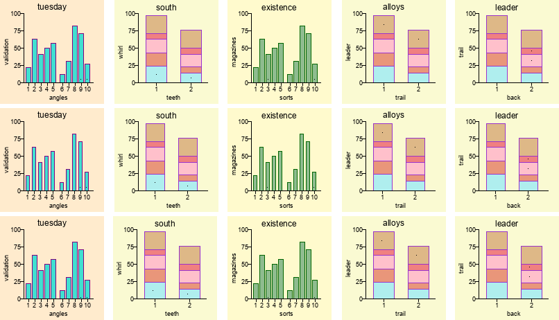
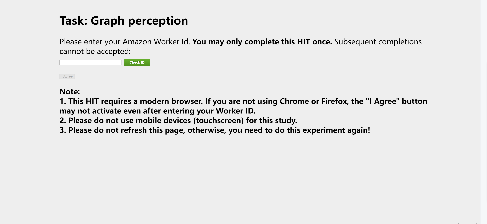
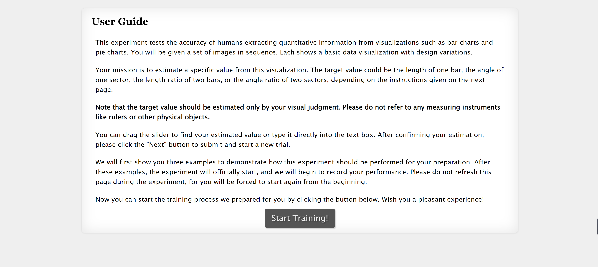
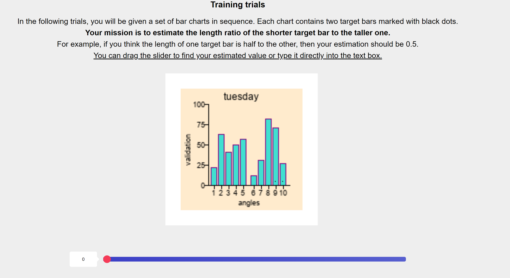
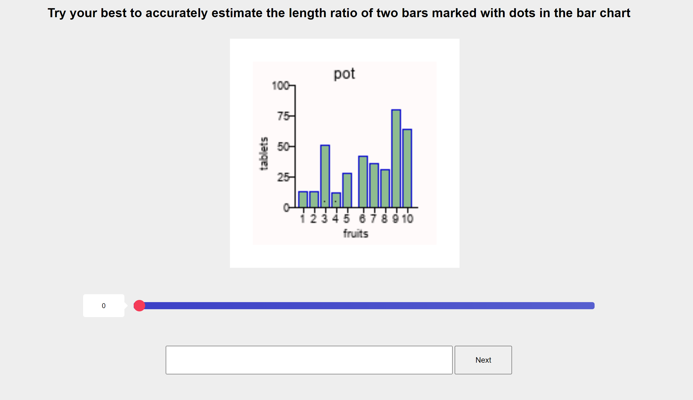

# Supplementary Materials for Generalization of Convolutional Neural Networks on Relational Reasoning with Bar Charts

## Introduction
We provide organized code and data used in our experiments and evaluation of CNNs' generalization on relational reasoning tasks with bar charts.

Specifically, we include the code for generating chart stimuli and a mini-dataset containing example visualizations without and with perturbations in the GRAPE dataset. 

For CNN evaluation, we provide the following:
- The code for the tested CNN architectures (LeNet, VGG, Xception, and ResNet).
- Their training and testing scripts.
- Our pre-trained models on five types of bar charts with corresponding evaluation performances.

For the user study, we include the following:
- The program code.
- Screenshot of the user interface.
- Collected raw data.
- The code for processing and analysis.

These materials should be sufficient for replicating and assessing our study. We will make the GRAPE dataset and all materials publicly available upon acceptance of the paper.

## GRAPE Dataset

The GRAPE dataset is, to our knowledge, the first generalization benchmark dataset for graphical perception tasks, which consists of a large set of synthesized standard visualizations and their element-wise perturbed counterparts with exposed and programmable parameters defined by Vega-Lite grammar.

### File Structure

```
├─eval_generalization
	├─Dataset  -- code for generating standard visualizations
	│          
	├─GRAPE  -- mini-dataset containing example visualizations
	│      test.zip  -- test dataset for iid and ood generalization
	│      train.zip  -- training dataset
	│      example.png  -- example visualization images in GRAPE
```

### Dataset Generation

```
python GenDataset.py --config_file TASK/genData.json --datasetName <task>
# example
python GenDataset.py --config_file TASK/genData.json --datasetName posLen_tp_1_rand_c
# adding attention mask
python GenDataset.py --config_file TASK/genData.json --datasetName posLen_tp_1_rand_c_mask
# using data augmentation
python GenDataset.py --config_file TASK/genData.json --datasetName posLen_tp_mix_barLength_barWidth
```

### Mini-Dataset

Since the whole GRAPE dataset is too large and users can generate any number of visualizations using the code above, we provide a mini-dataset to give a rough picture of how GRAPE looks like. For more detailed introduction, please refer to our paper.

`train.zip` contains the training stimuli (with ground truth) of the 5 types of position-length experiment. We include 500 images for each type. `test.zip` contains the test stimuli (with ground truth) of the 5 types of position-length experiment both in IID tests and different levels of various perturbed parameters in OOD tests. We include 50 images for each level.

Figure below shows generated examples in the dataset, the first row is IID test stimuli, the second and third are OOD test stimuli with perturbations in *bar width* and *dot position*.

### 

## CNN Evaluation
### File Structure

```
├─eval_generalization
    │  Attention_Map.py  -- generating saliency map using Grad-CAM
    │  GenDataset.py  -- generating dataset
    │  grad_cam_.py  -- Grad-CAM
    │  MainTrain.py  -- model training 
    │  MLAECompute.py  --compute MLAE
    │  MLAEcompute_again.py  -- process computing results
    │  RunTest.py  -- model testing
    │      
    ├─Networks
    │  │  TrainResNet.py  -- ResNet
    │  │  TrainVGG.py  -- VGG
    │  │  TrainXception.py  -- Xception
    │  │  TrainLeNet.py  -- LeNet
    │          
    ├─TASK  -- position-length experiment
    │  │  genData.json  -- generating parameter configuration files for training stimuli
    │  │  genData_test.json  -- generating parameter configuration files for test stimuli
    │  │  test.json  -- configuration file for model training
    │  │  train.json  -- configuration file for model testing
    │  │  
    │  ├─data  -- configuration files for generated dataset
    │  │  │  
    │  │  └─set  
    │  │      │  genTestdata_posLen_tp_1_progressive.py  -- generating configuration files for testing
    │  │      │  posLen_tp_1_rand_c.json  -- configuration file for position-length type1
    │  │      │  posLen_tp_1_rand_c_mask.json  -- configuration file for position-length type1 with mask
    │  │      │  posLen_tp_mix_barLength_barWidth.json  -- configuration file for data augmentation
    │  │      │  
    │  │      └─ detail  -- detailed parameter settings
    │  │                  
    │  └─model  -- configuration files of pre-trained models
    │          resnet152.json  -- resnet152
    │          resnet152_mask.json  -- resnet152 trained with attention mask
    │          
    └─util
```

### Network Training and Testing

#### Training CNN Models

```
python MainTrain.py --config_file TASK/train.json --datasetName <task> --modelName <modelname> --gpu <gpu>
# example
python MainTrain.py --config_file TASK/train.json --datasetName posLen_tp_1_rand_c --modelName resnet152 --gpu 0
# training with attention masks
python MainTrain.py --config_file TASK/train.json --datasetName posLen_tp_1_rand_c_mask --modelName resnet152_mask --gpu 0
# training with data augmentation
python MainTrain.py --config_file TASK/train.json --datasetName posLen_tp_mix_barLength_barWidth --modelName resnet152 --gpu 0
```

#### Testing CNN Models

```
python RunTest.py --config_file TASK/test.json --trainDatasetName <task> --modelName <modelname> --datasetName <task>_<param> --testdataName testdata_<level> --gpu <gpu>
# example
python RunTest.py --config_file TASK/test.json --trainDatasetName posLen_tp_1_rand_c --modelName resnet152 --datasetName posLen_tp_1_rand_c_barWidth --testdataName testdata_0 --gpu 0
# testing with attention masks
python RunTest.py --config_file TASK/test.json --trainDatasetName posLen_tp_1_rand_c_mask --modelName resnet152_mask --datasetName posLen_tp_1_rand_c_barWidth --testdataName testdata_0 --gpu 0
# testing with data augmentation
python RunTest.py --config_file TASK/test.json --trainDatasetName posLen_tp_mix_barLength_barWidth --modelName resnet152 --datasetName posLen_tp_mix --testdataName testdata_0 --gpu 0
```

### Activation Map Generation

Using Grad-CAM to generating saliency maps that show the important regions in the image which CNNs mainly use to make inferences.

```
python Attention_Map.py --config_file TASK/test.json --trainDatasetName <task> --modelName <modelname> --datasetName <task>_<param> --testdataName testdata_<level> --gpu <gpu>
# example
python Attention_Map.py --config_file TASK/test.json --trainDatasetName posLen_tp_1_rand_c --modelName resnet152 --datasetName posLen_tp_1_rand_c_barWidth --testdataName testdata_1 --gpu 0
```

## Raw Performance Data

We open-source the raw performance data collected from CNN evaluation and user study.

### File Structure

```
├─raw_results
    ├─cnn_results  -- raw performance data of CNN models
    ├─user_data  -- raw performance data of human subjects in user study
    └─user_progressive  -- raw performance data of human subjects under progressive perturbations
```

## User Study
### File Structure

```
├─user_study
    ├─analyse_code  -- code for analyzing raw results
    ├─screenshots  -- screenshots of our web application in user study
    └─web_program_code  -- paragram code for our web application used to conduct user study
```

### User Interface

We include the paragram code for our web application used to conduct user study in `web_program_code`. Here we show our user study procedure by taking screenshots of the interface of our web application.

Step 1: User registration

Step 2: Task introduction

Step 3: Training trials for users to familiarize with the interface and task.

Step 4: Official trials

Step 5: Face-to-face interview (no interface)

Raw data collected from this procedure is included in `raw_results/user_data`, we provide the analysis code for processing raw data in `user_study/analyse_code` to compute MLAE values.
